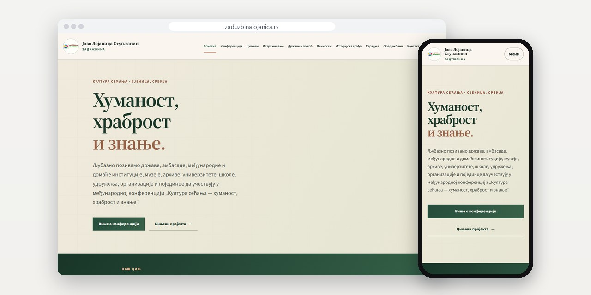
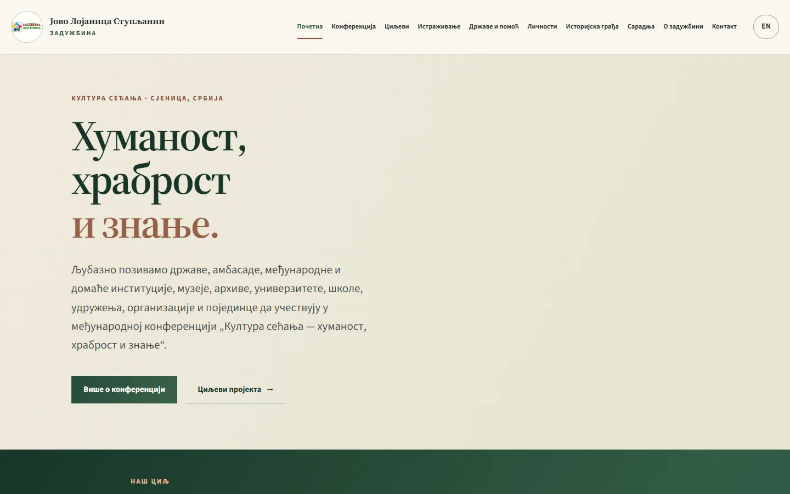
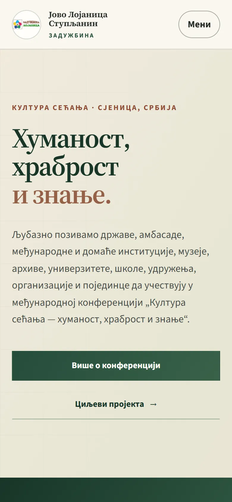

# Zadužbina Jovo Lojanica Stupljanin

Novi sajt za zadužbinu iz Sjenice koja istražuje stranu pomoć Srbiji u Velikom ratu, prenet sa Drupala 7, a sa njim i hosting i pošta.

**[zaduzbinalojanica.rs](https://zaduzbinalojanica.rs/)** · [English](README.md)

> [!NOTE]
> Klijentski projekat. Izvorni kod pripada klijentu i čuva se u privatnom repozitorijumu. Ova stranica opisuje šta sam uradio i kako.

<table>
  <tr><td><b>Klijent</b></td><td>Zadužbina Jovo Lojanica Stupljanin</td></tr>
  <tr><td><b>Delatnost</b></td><td>Istraživanje strane humanitarne pomoći Srbiji u Velikom ratu</td></tr>
  <tr><td><b>Lokacija</b></td><td>Sjenica</td></tr>
  <tr><td><b>Vrsta</b></td><td>Dvojezični sajt sa više strana</td></tr>
  <tr><td><b>Moj deo posla</b></td><td>Redizajn, izrada, selidba, hosting i održavanje</td></tr>
  <tr><td><b>Tehnologije</b></td><td>PHP 8.3, SQLite, nginx</td></tr>
</table>

## O projektu

Zadužbina istražuje stranu humanitarnu pomoć Srbiji u Velikom ratu: države, misije i ljude koji su lečili, štitili i pomagali. Prikuplja dokumenta, fotografije, pisma i dnevnike, a u Sjenici organizuje međunarodnu naučnu konferenciju. Stari sajt je radio na Drupalu 7. Napravio sam novi i preselio hosting i poštu na svoj server, bez ijedne izgubljene poruke.

Novi sajt je na srpskoj ćirilici, sa engleskom verzijom. Ima oko 36 strana koje PHP 8.3 renderuje iz SQLite baze i nema nijednu formu: prijave za konferenciju i istorijska građa stižu mejlom. Strana za slanje građe kaže šta treba navesti i šta se posle dešava: original ostaje kod vlasnika, zadužbina čuva digitalnu kopiju, a uz svaku objavljenu jedinicu piše odakle potiče.

## Šta sam uradio

- Stari sajt na Drupalu 7 napravljen iznova u PHP 8.3, sa SQLite bazom i renderovanjem na serveru
- Oko 36 strana na srpskoj ćirilici i na engleskom
- Deo o konferenciji sa programom i spiskom podataka koje prijava treba da sadrži
- Strane o šest pravaca istraživanja, državama koje su pomagale, ličnostima i istorijskoj građi
- Strana za slanje građe koja objašnjava šta biva sa originalom, a šta sa kopijom
- Hosting i sandučići preseljeni na moj server bez izgubljene pošte

## Merenja

| | Performanse | Pristupačnost | Dobre prakse | SEO |
| :-- | :-: | :-: | :-: | :-: |
| Telefon | 89 | 100 | 100 | 100 |
| Desktop | 100 | 100 | 100 | 100 |

Lighthouse, laboratorijsko merenje živog sajta, septembar 2026.

## Snimci ekrana

<table>
  <tr>
    <td width="68%" valign="top"></td>
    <td width="32%" valign="top"></td>
  </tr>
</table>

---

Izrada: [D. Svilenković](https://svilenkovic.rs).
